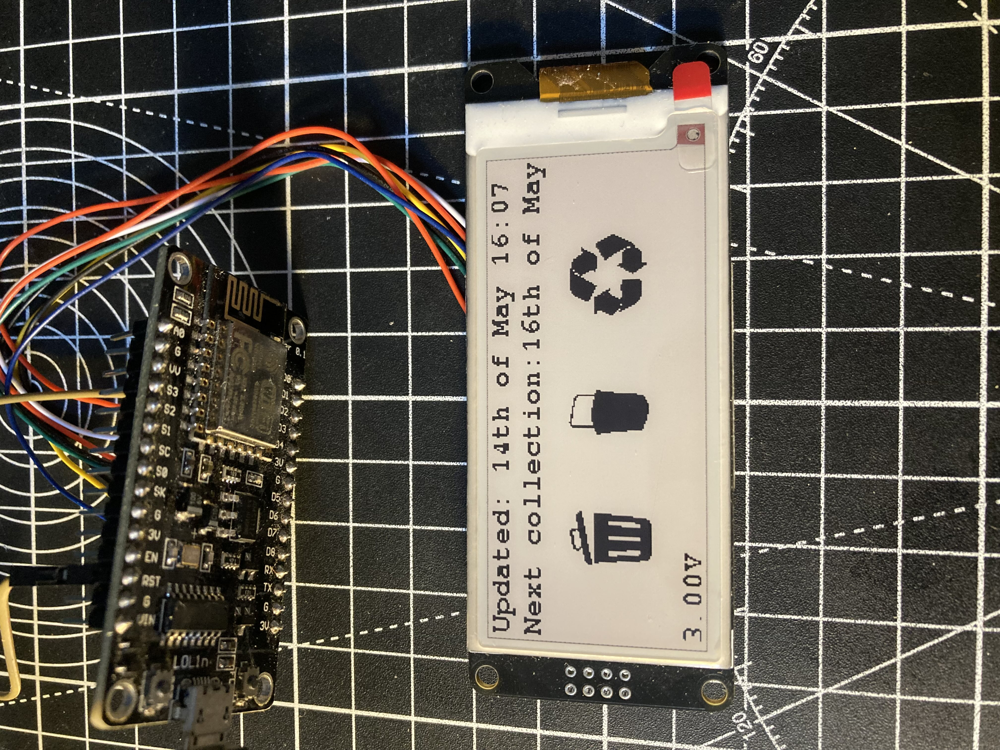

# The prototype for a bin collection display

### The problem
Our bins our not on a regular schedule and due to strikes, never consistent, the website is often slow to load in the evening before the collection day.

### The solution

- A fridge magnet or small kitchen display that shows the next collection day and what bins are being collected.
- Updates every 10 hours?
- ESP32 based with E-ink display
- Each of the three different types of bins general, food and recycling are displayed as an image if they are being collected

### Yet to-do
- Battery powered for around a year?
- 3D printed enclosure